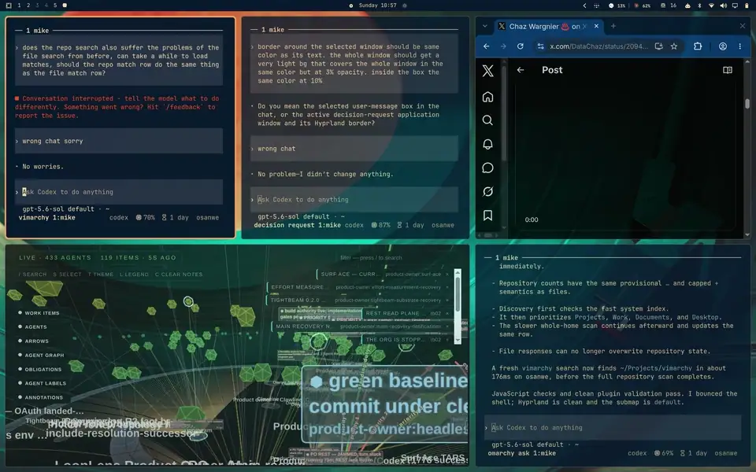

# Vimarchy

<p align="center">
  
</p>

Vimium-style window management UI for Omarchy.

Press a shortcut, see a large hint over every visible window, then use the
hints to focus, swap, or pair windows directly through Hyprland.

## Moves

| Gesture | Move | Result |
| --- | --- | --- |
| Tap a hint | **Focus** | Focus that window. |
| Double-tap a hint | **Focus action** | Run the action configured for the current layout. By default, `dwindle` and `scrolling` toggle a full working-area view, while `master` promotes the window to master. |
| Hold a hint, then tap another | **Swap** | Exchange the two windows' tiled positions. |
| Hold a hint, then hold another | **Pair** | In `dwindle`, make the two windows sibling tiles in the split tree. |
| `Escape` | **Cancel** | Dismiss Vimarchy without moving a window. |

The first held hint is the source. To keep ordinary taps visually clean, its
progress ring waits through a 100 ms grace period, then draws over 250 ms.
Move mode begins at the same 350 ms hold threshold and shows every available
destination. From there:

- **Hold `A`, tap `S`** to swap windows `A` and `S`.
- **Hold `A`, hold `S`** to pair windows `A` and `S` in `dwindle`.

Pairing is not a Hyprland tabbed window group. It makes the two windows sibling
leaves in the `dwindle` layout tree, placing the source on the side it already
occupies relative to the destination. Pair is deliberately unavailable in
other layouts; holding a destination there leaves move mode open so you can
still tap a destination to swap or press `Escape` to cancel.

## Install

```bash
omarchy plugin add https://github.com/clickety-clacks/vimarchy --enable
```

Add the static modal map and launcher to `~/.config/hypr/bindings.lua`:

```lua
local vimarchy = os.getenv("HOME") .. "/.config/omarchy/plugins/vimarchy/bin"
local hint_keys = "asdfghjklqwertyuiopzxcvbnm"

local function vimarchy_escape_bindings()
  hl.bind("SUPER + comma", hl.dsp.exec_cmd(vimarchy .. "/settings"))
  hl.bind("ESCAPE", hl.dsp.exec_cmd(vimarchy .. "/cancel"))
  hl.bind("ALT + SPACE", hl.dsp.exec_cmd(vimarchy .. "/cancel"))
  hl.bind("SUPER + ESCAPE", hl.dsp.submap("reset"))
end

hl.define_submap("vimarchy", function()
  for slot = 1, #hint_keys do
    local letter = hint_keys:sub(slot, slot)
    hl.bind(letter, hl.dsp.exec_cmd(vimarchy .. "/press " .. letter))
    hl.bind(letter, hl.dsp.exec_cmd(vimarchy .. "/release " .. letter), { release = true })
  end
  vimarchy_escape_bindings()
end)

hl.define_submap("vimarchy-double", function()
  for first = 1, #hint_keys do
    local letter = hint_keys:sub(first, first)
    hl.bind(letter, hl.dsp.submap("vimarchy-" .. letter))
  end
  vimarchy_escape_bindings()
end)

for first = 1, #hint_keys do
  local first_letter = hint_keys:sub(first, first)
  hl.define_submap("vimarchy-" .. first_letter, function()
    for second = 1, #hint_keys do
      local second_letter = hint_keys:sub(second, second)
      local hint = first_letter .. second_letter
      hl.bind(second_letter, hl.dsp.exec_cmd(vimarchy .. "/press " .. hint))
      hl.bind(second_letter, hl.dsp.exec_cmd(vimarchy .. "/release " .. hint), { release = true })
    end
    vimarchy_escape_bindings()
  end)
end

hl.define_submap("vimarchy-swap", function()
  for slot = 1, #hint_keys do
    local letter = hint_keys:sub(slot, slot)
    hl.bind(letter, hl.dsp.exec_cmd(vimarchy .. "/swap-press " .. letter))
    hl.bind(letter, hl.dsp.exec_cmd(vimarchy .. "/swap-release " .. letter), { release = true })
  end
  vimarchy_escape_bindings()
end)

hl.define_submap("vimarchy-swap-double", function()
  for first = 1, #hint_keys do
    local letter = hint_keys:sub(first, first)
    hl.bind(letter, hl.dsp.submap("vimarchy-swap-" .. letter))
  end
  vimarchy_escape_bindings()
end)

for first = 1, #hint_keys do
  local first_letter = hint_keys:sub(first, first)
  hl.define_submap("vimarchy-swap-" .. first_letter, function()
    for second = 1, #hint_keys do
      local second_letter = hint_keys:sub(second, second)
      local hint = first_letter .. second_letter
      hl.bind(second_letter, hl.dsp.exec_cmd(vimarchy .. "/swap-press " .. hint))
      hl.bind(second_letter, hl.dsp.exec_cmd(vimarchy .. "/swap-release " .. hint), { release = true })
    end
    vimarchy_escape_bindings()
  end)
end

-- After a normal selection, only a quick repeat of that hint's final letter is
-- intercepted. Every other key continues to the newly focused application.
for slot = 1, #hint_keys do
  local letter = hint_keys:sub(slot, slot)
  hl.define_submap("vimarchy-double-tap-" .. letter, function()
    hl.bind(letter, hl.dsp.exec_cmd(vimarchy .. "/double-tap " .. letter))
    hl.bind("ESCAPE", hl.dsp.exec_cmd(vimarchy .. "/cancel"))
    hl.bind("ALT + SPACE", hl.dsp.exec_cmd(vimarchy .. "/cancel"))
    hl.bind("SUPER + ESCAPE", hl.dsp.submap("reset"))
  end)
end

hl.define_submap("vimarchy-settings", function()
  hl.bind("ESCAPE", hl.dsp.exec_cmd(vimarchy .. "/cancel"))
  hl.bind("ALT + SPACE", hl.dsp.exec_cmd(vimarchy .. "/cancel"))
  hl.bind("SUPER + ESCAPE", hl.dsp.submap("reset"))
end)

o.bind("ALT + SPACE", "Vimarchy window hints", vimarchy .. "/open")
```

Hyprland reloads the binding automatically. Validate it with:

```bash
hyprctl reload
hyprctl configerrors
```

## Behavior

- Shows only mapped windows on the workspaces currently visible across outputs.
- Includes visible special-workspace and pinned windows.
- Prioritizes home-row letters: `a s d f g h j k l`, then the remaining letters.
- Opens settings from the active hint map with `Super+,`.
- Keeps the window hints visible behind the settings card as a live opacity
  preview; `Escape`, `Alt+Space`, or `Done` closes both.
- Uses one-letter hints for up to 26 windows. Above that, all hints become
  unambiguous two-letter sequences such as `aa`, `as`, and `ad`.
- Remembers assignments by Hyprland stable window ID, including windows on
  other workspaces. A letter is reused only after its window closes.
- Supports multiple outputs and fractional scaling.
- Holding the final key of a hint for 350 ms enters move mode. The source
  window tint becomes 50% opaque and lines connect its hint to every available
  destination. After a 100 ms visual grace period, the source ring draws over
  the remaining 250 ms; when move mode begins, destination rings and connector
  lines flash at full opacity before settling to their normal opacity.
- In move mode, tapping a destination swaps it with the source. Holding a
  destination for 350 ms on a `dwindle` workspace reparents the source and
  destination as sibling tiles. Their side follows the source window's current
  position relative to the destination. Holding a destination in any other
  layout does nothing and leaves swap mode active.
- Quickly repeating a selected hint's final letter focuses it and runs a
  layout-specific double-tap action.
  `dwindle` and `scrolling` toggle a maximized working-area view that keeps the
  bar visible; `master` promotes the window and does nothing if it is already
  master. Recognition happens on the second key-down, so no pause is required
  between releasing the first tap and pressing the second.
- Move mode resolves both stable IDs again immediately before the operation,
  so a closed or replaced client cannot redirect the action.
- Press Escape to cancel.

## Double-tap actions

Vimarchy reads optional double-tap configuration from
`~/.config/omarchy/vimarchy.json`. Omitted layouts retain their defaults. A
layout can select a built-in action, be disabled, or invoke a command directly:

```json
{
  "doubleTap": {
    "timeoutMs": 280,
    "layouts": {
      "dwindle": "toggle-maximized",
      "scrolling": ["my-scrolling-focus-script"],
      "master": "promote-master",
      "custom-layout": {
        "command": ["sh", "-lc", "do-something-with $VIMARCHY_WINDOW_ADDRESS"]
      }
    }
  }
}
```

Built-ins are `toggle-maximized`, `promote-master`, and `disabled`. Callback
commands run without an implicit shell and receive `VIMARCHY_LAYOUT`,
`VIMARCHY_WINDOW_ADDRESS`, `VIMARCHY_WINDOW_STABLE_ID`,
`VIMARCHY_WORKSPACE_ID`, `VIMARCHY_FULLSCREEN_STATE`, and `VIMARCHY_HINT`.
Use an explicit `sh -lc` argv as above only when shell syntax is wanted. See
[`vimarchy.example.json`](vimarchy.example.json) for the complete defaults.
`timeoutMs` is measured from the first key-down to the second key-down,
defaults to 280 ms, and is clamped to the supported 120–600 ms range.

## Keyboard safety

Vimarchy's layer surface is input-passive: it never grabs the Wayland
keyboard. Static Hyprland submaps distinguish release taps from long presses,
route swap destinations, and briefly capture only the selected hint's final
letter for double-tap detection. A first-press candidate also recognizes a
second key-down that arrives before release IPC has installed that transient
map. Other typing remains unbound. Normal bindings are never removed or
rewritten. `Super+Escape` always resets the submap before asking the overlay to
close, even if the plugin is broken or missing.

## Requirements

- Omarchy Quattro
- Hyprland
- Omarchy Shell / Quickshell
- `hyprctl` and `jq` (included with Omarchy)

## Status

Early spike. The core behavior works, but visual and multi-output edge cases
still need broader testing.
